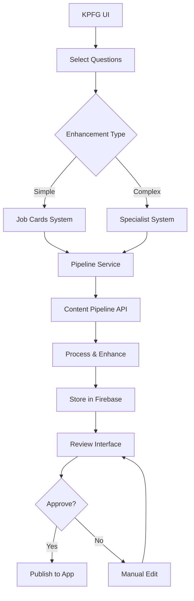

# KPFG Content Pipeline Integration Plan

## Overview
Integration strategy for connecting the Content Pipeline (AI-powered content generation) with KPFG's existing React/Firebase architecture.

## Architecture Approach

### 1. Backend Integration Points

#### Firebase Collections (New)
```typescript
// Enhanced content collections
export const enhancedCollections = {
  pipelineJobs: 'pipelineJobs',          // Track pipeline processing jobs
  enhancedQuestions: 'enhancedQuestions', // Store pipeline output
  guidelines: 'guidelines',                // Cache medical guidelines
  processingQueue: 'processingQueue'      // Queue for batch processing
};
```

#### Enhanced Question Schema
```typescript
interface EnhancedQuestion extends Question {
  // Pipeline-specific fields
  enhancedQuestion?: string;
  vignette?: string;
  explanation?: string;
  tips?: string;
  flashcards?: string; // JSON string
  mcq?: string;        // JSON string
  media?: MediaRecommendation[];
  references?: {
    guidelines: string[];
    sources: string[];
  };
  pipelineVersion?: string;
  processingDate?: Timestamp;
  enhancementType?: 'jobcard' | 'specialist' | 'manual';
}
```

### 2. Pipeline Service Integration

Create new service: `/src/services/pipelineService.ts`

```typescript
class PipelineService {
  // Process single question through pipeline
  async enhanceQuestion(question: Question): Promise<EnhancedQuestion>;
  
  // Batch process multiple questions
  async enhanceBatch(questions: Question[]): Promise<PipelineJob>;
  
  // Check job status
  async getJobStatus(jobId: string): Promise<JobStatus>;
  
  // Get pipeline agents/specialists
  async getAvailableAgents(): Promise<Agent[]>;
  
  // Search medical guidelines
  async searchGuidelines(query: string): Promise<Guideline[]>;
}
```

### 3. UI Components Architecture

#### New Pages
1. **Pipeline Dashboard** (`/pipeline`)
   - Overview of processing jobs
   - Quick stats (processed, pending, failed)
   - Recent enhancements

2. **Batch Processing** (`/pipeline/batch`)
   - Select questions for enhancement
   - Choose enhancement type (jobcard vs specialist)
   - Monitor progress
   - Review results

3. **Enhancement Review** (`/pipeline/review`)
   - Side-by-side comparison (original vs enhanced)
   - Approve/reject enhancements
   - Manual editing capability

#### New Components
```
/src/components/pipeline/
├── PipelineStatus.tsx        // Job status indicator
├── EnhancementSelector.tsx   // Choose enhancement type
├── GuidelineSearch.tsx       // Search medical guidelines
├── EnhancedQuestionCard.tsx  // Display enhanced content
├── BatchProcessor.tsx        // Batch processing UI
├── ReviewInterface.tsx       // Review/approve content
└── PipelineMetrics.tsx      // Analytics dashboard
```

### 4. Integration Flow



### 5. Implementation Steps

#### Phase 1: Core Infrastructure (Week 1)
1. **Firebase Setup**
   - Create new collections
   - Update security rules
   - Add indexes for queries

2. **Pipeline Service**
   - Create service class
   - Implement API communication
   - Add error handling

3. **Basic UI**
   - Pipeline dashboard
   - Navigation updates
   - Status components

#### Phase 2: Enhancement Features (Week 2)
1. **Batch Processing**
   - Question selection UI
   - Progress tracking
   - Real-time updates

2. **Review Interface**
   - Split-screen comparison
   - Editing capability
   - Approval workflow

3. **Integration Testing**
   - End-to-end flow
   - Error scenarios
   - Performance testing

#### Phase 3: Advanced Features (Week 3)
1. **Guideline Integration**
   - Search interface
   - Caching system
   - Reference linking

2. **Analytics**
   - Processing metrics
   - Quality scores
   - Usage statistics

3. **Optimization**
   - Batch performance
   - UI responsiveness
   - Cache strategies

### 6. Key Integration Files to Create

```
/src/lib/pipeline/
├── config.ts         // Pipeline configuration
├── types.ts          // TypeScript definitions
├── api.ts            // API client
└── utils.ts          // Helper functions

/src/hooks/
├── usePipeline.ts    // Pipeline operations hook
├── useEnhancement.ts // Enhancement state
└── useBatchProcess.ts // Batch processing

/src/store/
└── pipelineStore.ts  // Zustand store for pipeline state
```

### 7. API Endpoint Structure

```typescript
// Pipeline API endpoints
const PIPELINE_API = {
  enhance: '/api/pipeline/enhance',
  batch: '/api/pipeline/batch',
  status: '/api/pipeline/status/:jobId',
  agents: '/api/pipeline/agents',
  guidelines: '/api/pipeline/guidelines/search'
};
```

### 8. User Flow

1. **Content Creator Journey**
   - Creates basic questions in KPFG
   - Selects questions for enhancement
   - Chooses enhancement level
   - Reviews enhanced content
   - Publishes to student app

2. **Batch Processing Flow**
   - Upload protocol/multiple questions
   - System analyzes complexity
   - Routes to appropriate agents
   - Processes in background
   - Notifies when complete

### 9. Technical Considerations

#### Performance
- Implement pagination for large batches
- Use React Query for caching
- Progressive loading for reviews
- Background processing for large jobs

#### Security
- Validate all pipeline inputs
- Sanitize enhanced content
- Maintain audit trail
- Role-based access control

#### Error Handling
- Graceful degradation
- Retry mechanisms
- Clear error messages
- Fallback to manual enhancement

### 10. Migration Strategy

1. **Existing Content**
   - Keep original questions intact
   - Add enhancement as overlay
   - Gradual migration approach

2. **Backward Compatibility**
   - Support both enhanced and regular questions
   - Fallback rendering for older content
   - Version tracking

### 11. Success Metrics

- Processing speed: < 30s per question
- Enhancement quality: > 95% approval rate
- User satisfaction: Reduced content creation time by 70%
- System reliability: 99.9% uptime

## Next Steps

1. Set up development environment
2. Create Firebase collections
3. Build pipeline service
4. Implement basic UI
5. Test with sample data
6. Iterate based on feedback

## Resources

- Content Pipeline Documentation: `/Content pipeline/`
- KPFG Codebase: `/apps/kpfg/`
- Enhancement Agents: `/Content pipeline/enhancement-agent-*.md`
- Processing Instructions: `/Content pipeline/Content creation flow/`