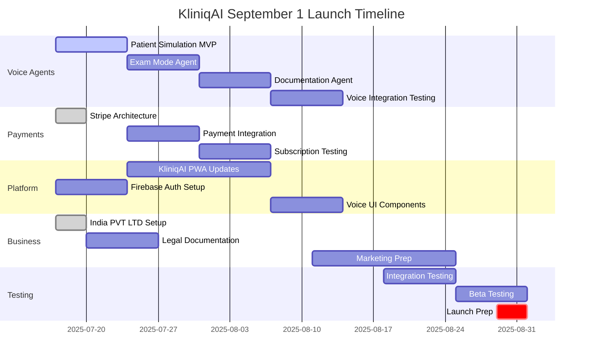
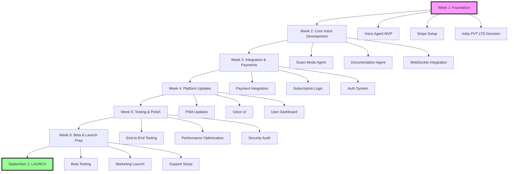
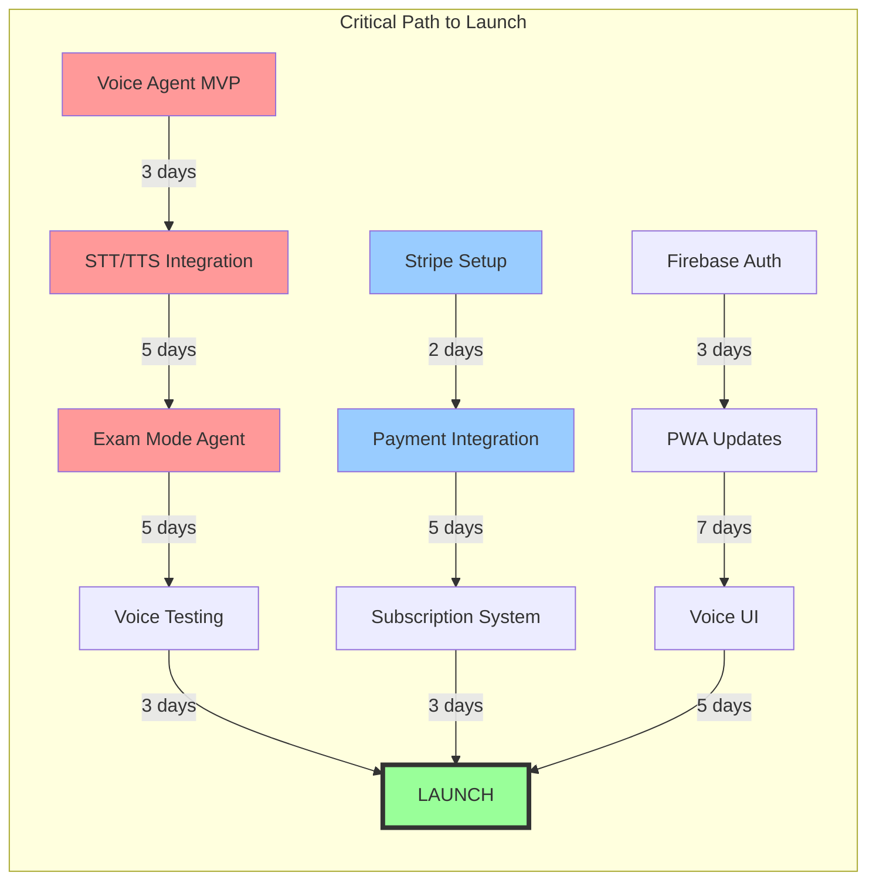
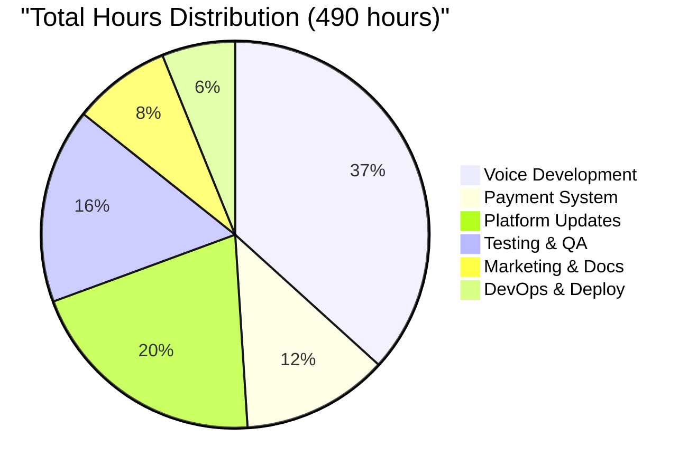
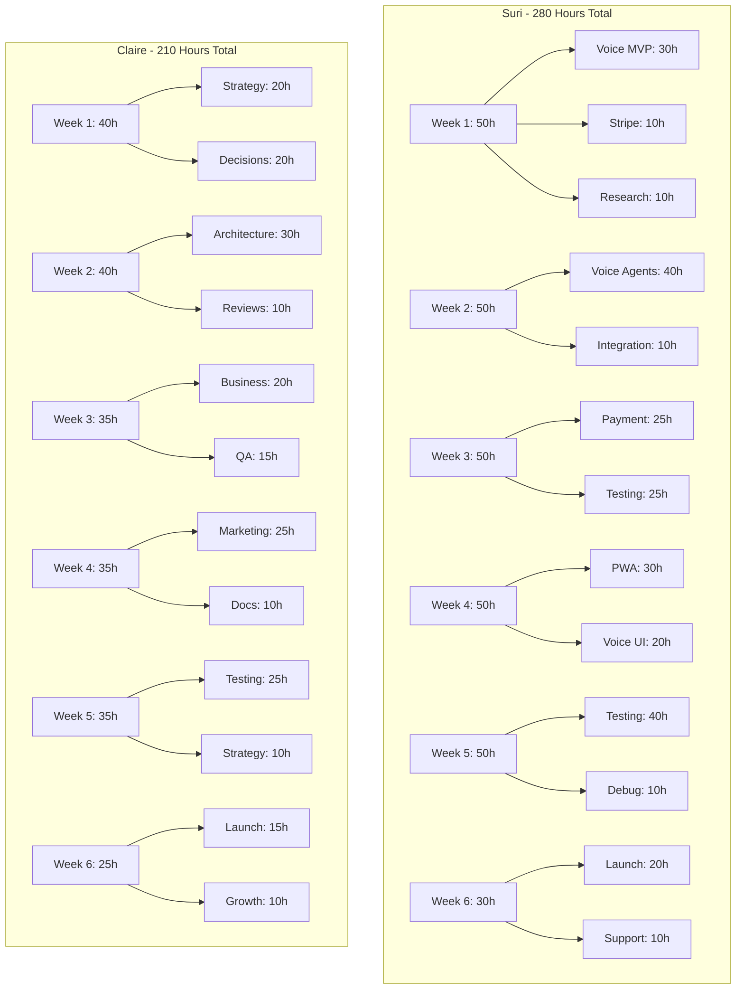
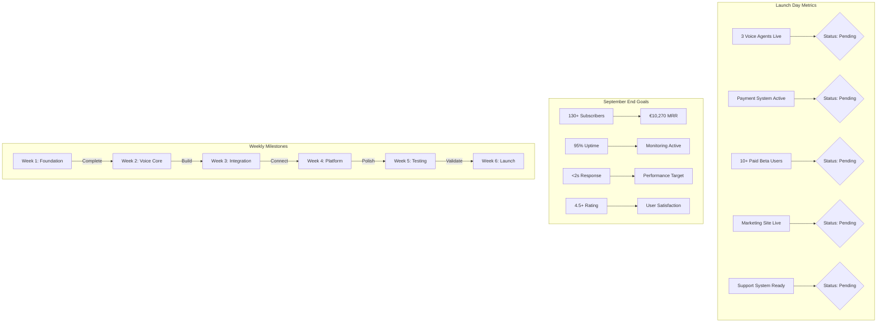
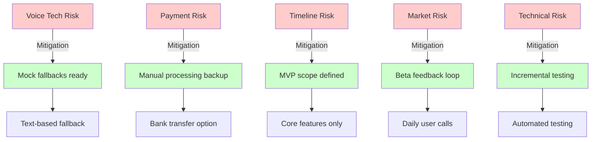

# September 1 Launch Visual Roadmap - KliniqAI Voice Platform

**Date**: July 18, 2025  
**Timeline**: 6 Weeks to Launch  
**Team**: Suri (Technical Lead) + Claire (Project Lead)

## 🎯 Executive Summary: Voice Platform Launch (€79/month)

### Key Decision: Pivoting from MCQ Beta to Premium Voice Platform
- **Original Plan**: July 30 beta with 100 users for MCQ platform
- **New Strategy**: September 1 launch with voice simulation agents
- **Price Point**: €79/month (raised from €49)
- **Revenue Target**: €10K MRR by end of September

## Visual Timeline Overview



## Development Flow Visualization



## 📅 WEEK-BY-WEEK VISUAL EXECUTION PLAN

### WEEK 1 (July 17-23): FOUNDATION SPRINT

```
┌─────────────────────────────────────────────────────────────────────────────────┐
│                              WEEK 1 PRIORITIES                                 │
│                                                                                 │
│  CRITICAL PATH: Voice Agent MVP + Business Entity Resolution                   │
│  SUCCESS METRIC: Patient simulation agent functional + Legal clarity           │
└─────────────────────────────────────────────────────────────────────────────────┘

SURI - TECHNICAL FOCUS                    CLAIRE - STRATEGIC FOCUS
┌─────────────────────────────────┐      ┌─────────────────────────────────┐
│  VOICE AGENT DEVELOPMENT        │      │  BUSINESS OPERATIONS            │
│  ├─ Mon-Tue: Patient agent MVP  │      │  ├─ Mon: Nabeel communication   │
│  ├─ Wed-Thu: LiveKit optimize   │      │  ├─ Tue: German legal research  │
│  ├─ Fri-Sat: API specs create   │      │  ├─ Wed: India PVT LTD start    │
│  └─ Sun: Performance testing    │      │  └─ Thu-Fri: Stripe research    │
└─────────────────────────────────┘      └─────────────────────────────────┘

PARALLEL EXECUTION OPPORTUNITIES:
• Voice agent development (Suri) || Business setup (Claire)
• API specification (Suri) || Legal framework (Claire)
• Performance testing (Suri) || Financial planning (Claire)

RISK POINTS:
⚠️ Voice agent complexity delays
⚠️ Nabeel unresponsive (48-hour deadline)
⚠️ India PVT LTD registration delays

MITIGATION:
✅ Parallel agent development (3 agents simultaneously)
✅ India PVT LTD backup plan activated
✅ Professional CA/CS engagement
```

### WEEK 2 (July 24-30): DEVELOPMENT SPRINT

```
┌─────────────────────────────────────────────────────────────────────────────────┐
│                              WEEK 2 PRIORITIES                                 │
│                                                                                 │
│  CRITICAL PATH: All 3 Voice Agents + Payment System Setup                     │
│  SUCCESS METRIC: Complete voice agent suite + Stripe integration ready        │
└─────────────────────────────────────────────────────────────────────────────────┘

SURI - TECHNICAL FOCUS                    CLAIRE - STRATEGIC FOCUS
┌─────────────────────────────────┐      ┌─────────────────────────────────┐
│  VOICE AGENT COMPLETION         │      │  PAYMENT SYSTEM SETUP          │
│  ├─ Mon-Tue: Full exam agent    │      │  ├─ Mon: Stripe account setup   │
│  ├─ Wed-Thu: Documentation agent│      │  ├─ Tue: Payment UI design      │
│  ├─ Fri-Sat: All agents testing │      │  ├─ Wed: Protocol generation    │
│  └─ Sun: API implementation     │      │  └─ Thu-Fri: Integration plan   │
└─────────────────────────────────┘      └─────────────────────────────────┘

DEPENDENCIES:
• Week 1 patient agent → Week 2 full exam agent
• Week 1 API specs → Week 2 API implementation
• Week 1 business setup → Week 2 payment system

PARALLEL EXECUTION:
• Voice agent testing (Suri) || Payment configuration (Claire)
• API development (Suri) || Content pipeline (Claire)
• Performance optimization (Suri) || User flow design (Claire)

RISK POINTS:
⚠️ Voice agent integration complexity
⚠️ Payment system configuration delays
⚠️ Protocol generation bottlenecks

MITIGATION:
✅ Simplified MVP approach for voice agents
✅ Razorpay backup for payment processing
✅ KPFG automation for protocol generation
```

### WEEK 3 (July 31-Aug 6): INTEGRATION PHASE

```
┌─────────────────────────────────────────────────────────────────────────────────┐
│                              WEEK 3 PRIORITIES                                 │
│                                                                                 │
│  CRITICAL PATH: Voice Agent Integration + Payment System Testing              │
│  SUCCESS METRIC: End-to-end voice simulation with payment processing          │
└─────────────────────────────────────────────────────────────────────────────────┘

SURI - TECHNICAL FOCUS                    CLAIRE - STRATEGIC FOCUS
┌─────────────────────────────────┐      ┌─────────────────────────────────┐
│  PLATFORM INTEGRATION          │      │  BUSINESS FINALIZATION          │
│  ├─ Mon-Tue: Voice API → KliniqAI│      │  ├─ Mon: Entity registration    │
│  ├─ Wed-Thu: Payment integration│      │  ├─ Tue: Payment testing        │
│  ├─ Fri-Sat: Auth sync systems  │      │  ├─ Wed: Access control verify  │
│  └─ Sun: End-to-end testing     │      │  └─ Thu-Fri: Quality assurance  │
└─────────────────────────────────┘      └─────────────────────────────────┘

CRITICAL DEPENDENCIES:
• Week 2 voice agents → Week 3 integration
• Week 2 payment setup → Week 3 payment integration
• Week 2 API implementation → Week 3 auth sync

INTEGRATION CHECKPOINTS:
☑️ Voice agent API calls successful
☑️ Payment processing functional
☑️ User authentication synchronized
☑️ Access control working

RISK POINTS:
⚠️ Complex integration between systems
⚠️ Payment processing failures
⚠️ Authentication sync issues

MITIGATION:
✅ Staged integration approach
✅ Comprehensive testing protocols
✅ Rollback procedures prepared
```

### WEEK 4 (Aug 7-13): PLATFORM CONNECTION

```
┌─────────────────────────────────────────────────────────────────────────────────┐
│                              WEEK 4 PRIORITIES                                 │
│                                                                                 │
│  CRITICAL PATH: Complete Platform Integration + UI/UX Polish                   │
│  SUCCESS METRIC: Full user journey functional (signup → payment → voice)      │
└─────────────────────────────────────────────────────────────────────────────────┘

SURI - TECHNICAL FOCUS                    CLAIRE - STRATEGIC FOCUS
┌─────────────────────────────────┐      ┌─────────────────────────────────┐
│  UI/UX IMPLEMENTATION          │      │  LAUNCH PREPARATION             │
│  ├─ Mon-Tue: Voice UI in app    │      │  ├─ Mon: User experience test   │
│  ├─ Wed-Thu: Payment flow polish│      │  ├─ Tue: Customer support setup │
│  ├─ Fri-Sat: Full platform test │      │  ├─ Wed: Launch infrastructure  │
│  └─ Sun: Performance optimize   │      │  └─ Thu-Fri: Content pipeline   │
└─────────────────────────────────┘      └─────────────────────────────────┘

PLATFORM COMPLETION CHECKLIST:
☑️ Voice agents accessible through KliniqAI app
☑️ Payment processing integrated and tested
☑️ User authentication and access control working
☑️ Premium subscription tier functional
☑️ Customer support channels ready

QUALITY ASSURANCE:
• Cross-browser testing (Chrome, Firefox, Safari)
• Mobile responsiveness (iOS, Android)
• Payment method testing (multiple currencies)
• Voice agent performance under load

RISK POINTS:
⚠️ UI/UX complexity delays
⚠️ Performance issues under load
⚠️ Mobile compatibility problems

MITIGATION:
✅ Progressive Web App architecture
✅ Load testing and optimization
✅ Mobile-first design approach
```

### WEEK 5 (Aug 14-20): CONTENT & TESTING

```
┌─────────────────────────────────────────────────────────────────────────────────┐
│                              WEEK 5 PRIORITIES                                 │
│                                                                                 │
│  CRITICAL PATH: Content Pipeline + Comprehensive Testing                       │
│  SUCCESS METRIC: 30 protocols available + Platform stress tested              │
└─────────────────────────────────────────────────────────────────────────────────┘

SURI - TECHNICAL FOCUS                    CLAIRE - STRATEGIC FOCUS
┌─────────────────────────────────┐      ┌─────────────────────────────────┐
│  FINAL TESTING & OPTIMIZATION   │      │  CONTENT & MARKETING PREP       │
│  ├─ Mon-Tue: 30 protocols setup │      │  ├─ Mon: Marketing materials    │
│  ├─ Wed-Thu: End-to-end testing │      │  ├─ Tue: User onboarding design │
│  ├─ Fri-Sat: Performance tuning │      │  ├─ Wed: Launch communication   │
│  └─ Sun: Bug fixes and polish   │      │  └─ Thu-Fri: Partnership prep   │
└─────────────────────────────────┘      └─────────────────────────────────┘

CONTENT PIPELINE COMPLETION:
• 30 exam protocols processed through KPFG
• Voice agent training data optimized
• Quality assurance on all content
• German medical standards compliance

TESTING PROTOCOLS:
• Load testing (100 concurrent users)
• Payment processing stress testing
• Voice agent performance under load
• Mobile app functionality testing
• Security and data protection testing

RISK POINTS:
⚠️ Content generation delays
⚠️ Performance issues at scale
⚠️ Last-minute bugs discovered

MITIGATION:
✅ Parallel content processing
✅ Automated testing protocols
✅ Bug tracking and resolution system
```

### WEEK 6 (Aug 21-27): LAUNCH PREPARATION

```
┌─────────────────────────────────────────────────────────────────────────────────┐
│                              WEEK 6 PRIORITIES                                 │
│                                                                                 │
│  CRITICAL PATH: Final Testing + Launch Infrastructure                          │
│  SUCCESS METRIC: Launch-ready platform with monitoring and support            │
└─────────────────────────────────────────────────────────────────────────────────┘

SURI - TECHNICAL FOCUS                    CLAIRE - STRATEGIC FOCUS
┌─────────────────────────────────┐      ┌─────────────────────────────────┐
│  LAUNCH INFRASTRUCTURE          │      │  LAUNCH OPERATIONS              │
│  ├─ Mon-Tue: Final testing      │      │  ├─ Mon: Launch day planning    │
│  ├─ Wed-Thu: Deployment scripts │      │  ├─ Tue: Customer support train │
│  ├─ Fri-Sat: Monitoring setup   │      │  ├─ Wed: Marketing campaign     │
│  └─ Sun: Launch rehearsal       │      │  └─ Thu-Fri: Partnership deals  │
└─────────────────────────────────┘      └─────────────────────────────────┘

LAUNCH READINESS CHECKLIST:
☑️ All systems tested and operational
☑️ Payment processing verified
☑️ Customer support trained and ready
☑️ Marketing materials prepared
☑️ Monitoring and alerting active
☑️ Rollback procedures tested

LAUNCH INFRASTRUCTURE:
• Real-time monitoring dashboard
• Customer support ticket system
• Payment processing monitoring
• Platform performance tracking
• User feedback collection system

RISK POINTS:
⚠️ Last-minute technical issues
⚠️ Payment processing problems
⚠️ Customer support overwhelm

MITIGATION:
✅ Comprehensive testing protocols
✅ 24/7 monitoring and alerting
✅ Escalation procedures prepared
```

### WEEK 7 (Aug 28-Sep 1): LAUNCH WEEK

```
┌─────────────────────────────────────────────────────────────────────────────────┐
│                              LAUNCH WEEK                                       │
│                                                                                 │
│  CRITICAL PATH: Platform Launch + User Onboarding                             │
│  SUCCESS METRIC: Live platform with paying users                              │
└─────────────────────────────────────────────────────────────────────────────────┘

SURI - TECHNICAL FOCUS                    CLAIRE - STRATEGIC FOCUS
┌─────────────────────────────────┐      ┌─────────────────────────────────┐
│  LAUNCH EXECUTION               │      │  LAUNCH MANAGEMENT              │
│  ├─ Mon: Final deployment       │      │  ├─ Mon: Launch communications  │
│  ├─ Tue: Soft launch (limited)  │      │  ├─ Tue: User acquisition start │
│  ├─ Wed: Full platform launch   │      │  ├─ Wed: Customer support       │
│  ├─ Thu: User support & fixes   │      │  ├─ Thu: Metrics monitoring     │
│  └─ Fri: Celebration & planning │      │  └─ Fri: Success celebration    │
└─────────────────────────────────┘      └─────────────────────────────────┘

LAUNCH DAY SEQUENCE:
• 6:00 AM: Final system checks
• 8:00 AM: Platform activation
• 9:00 AM: Launch announcement
• 10:00 AM: Customer support activation
• 12:00 PM: Marketing campaign launch
• 6:00 PM: Day 1 metrics review

SUCCESS METRICS:
• Platform uptime: 99.9%+
• Payment success rate: 98%+
• Customer satisfaction: 4.5+ rating
• User registrations: 50+ Day 1

RISK POINTS:
⚠️ Platform overload from high demand
⚠️ Payment processing failures
⚠️ Customer support overwhelm

MITIGATION:
✅ Scalable infrastructure ready
✅ Multiple payment processor fallbacks
✅ 24/7 support team activated
```

## 🎯 CRITICAL PATH ANALYSIS



### PARALLEL EXECUTION OPPORTUNITIES

**Weeks 1-2:**
- Voice agent development (Suri) || Business setup (Claire)
- Technical architecture (Suri) || Legal framework (Claire)

**Weeks 3-4:**
- Platform integration (Suri) || Payment testing (Claire)
- UI/UX development (Suri) || Customer support setup (Claire)

**Weeks 5-6:**
- Performance optimization (Suri) || Marketing preparation (Claire)
- Bug fixes (Suri) || Partnership development (Claire)

## 📊 RESOURCE ALLOCATION AND TIME ESTIMATES

### Resource Distribution Overview



### Weekly Resource Distribution



### Resource Summary
- **Suri (280 hours total)**
  - Voice Agent Development: 140 hours
  - KPCG Integration: 60 hours
  - Payment System: 40 hours
  - Testing & Debugging: 40 hours

- **Claire (210 hours total)**
  - Technical Architecture: 50 hours
  - Business Operations: 60 hours
  - Marketing & Growth: 50 hours
  - Testing & QA: 50 hours

## 🚨 RISK ASSESSMENT AND MITIGATION MATRIX

### HIGH RISK FACTORS

**Technical Risks:**
- **Voice Agent Complexity**: Mitigation → Parallel development, MVP approach
- **Integration Challenges**: Mitigation → Staged integration, comprehensive testing
- **Performance Issues**: Mitigation → Load testing, scalable infrastructure

**Business Risks:**
- **Entity Registration Delays**: Mitigation → India PVT LTD backup active
- **Payment Processing Failures**: Mitigation → Multiple processor options
- **Market Reception**: Mitigation → Soft launch, user feedback integration

### MEDIUM RISK FACTORS

**Operational Risks:**
- **Content Generation Delays**: Mitigation → KPFG automation, parallel processing
- **Customer Support Overwhelm**: Mitigation → Scalable support system, FAQ automation
- **Marketing Campaign Delays**: Mitigation → Early preparation, multiple channels

### LOW RISK FACTORS

**External Risks:**
- **Regulatory Changes**: Mitigation → Compliance monitoring, legal counsel
- **Competitive Response**: Mitigation → Unique technology, first-mover advantage
- **Economic Factors**: Mitigation → Premium positioning, value demonstration

## 📈 SUCCESS METRICS AND MONITORING

### Success Metrics Dashboard



### WEEKLY MILESTONES

**Week 1:** ✅ Voice Agent MVP + Business Entity Resolution
**Week 2:** ✅ Complete Voice Agent Suite + Payment System Setup
**Week 3:** ✅ Platform Integration + Payment Processing
**Week 4:** ✅ UI/UX Complete + Full User Journey
**Week 5:** ✅ Content Pipeline + Comprehensive Testing
**Week 6:** ✅ Launch Infrastructure + Operations Ready
**Week 7:** ✅ LIVE PLATFORM + User Acquisition

### LAUNCH SUCCESS CRITERIA

**Technical Success:**
- Platform uptime: 99.9%+
- Payment success rate: 98%+
- Voice agent response time: <2 seconds
- Mobile compatibility: 100%

**Business Success:**
- User registrations: 100+ in first week
- Paying customers: 50+ in first month
- Customer satisfaction: 4.5+ rating
- Revenue: €3,950+ MRR by October 1

## 🎯 DAILY EXECUTION GUIDANCE

### MORNING STANDUP PROTOCOL (9:00 AM DAILY)

**Agenda (15 minutes maximum):**
1. **Yesterday's Progress**: What was completed
2. **Today's Priorities**: Top 3 tasks for each team member
3. **Blockers**: Any issues requiring immediate attention
4. **Decisions**: Any decisions needed from Claire

**Decision Framework:**
- **Technical Decisions**: Suri has full authority
- **Business Decisions**: Claire has full authority
- **Joint Decisions**: Resolve immediately in standup

### WEEKLY REVIEW PROTOCOL (FRIDAYS 5:00 PM)

**Review Agenda (30 minutes):**
1. **Week Completion**: Milestone achievement assessment
2. **Next Week Planning**: Priorities and resource allocation
3. **Risk Assessment**: Identify and mitigate upcoming risks
4. **Adjustment Decisions**: Any timeline or scope adjustments

### COMMUNICATION PROTOCOLS

**Slack Channels:**
- **#daily-progress**: Daily updates and quick questions
- **#technical-issues**: Technical problems and solutions
- **#business-operations**: Business and strategic discussions
- **#launch-countdown**: Launch preparation and coordination

**Emergency Escalation:**
- **Technical Issues**: Suri → Claire (30 minutes)
- **Business Issues**: Claire → Immediate decision
- **Launch Issues**: Both → War room activation

## 🚀 LAUNCH DAY EXECUTION PLAN

### SEPTEMBER 1, 2025 - LAUNCH DAY SCHEDULE

```
┌─────────────────────────────────────────────────────────────────────────────────┐
│                           LAUNCH DAY TIMELINE                                  │
│                                                                                 │
│  06:00 AM  Final System Checks          Claire + Suri                         │
│  07:00 AM  Platform Activation          Suri                                   │
│  08:00 AM  Launch Announcement          Claire                                  │
│  09:00 AM  Customer Support Activation  Claire                                 │
│  10:00 AM  Marketing Campaign Launch    Claire                                 │
│  12:00 PM  First User Registrations     Both                                   │
│  03:00 PM  Performance Monitoring       Suri                                   │
│  06:00 PM  Day 1 Metrics Review         Both                                   │
│  09:00 PM  Launch Success Celebration   Both                                   │
└─────────────────────────────────────────────────────────────────────────────────┘
```

### LAUNCH DAY SUCCESS METRICS

**Hour 1 (8:00-9:00 AM):**
- Platform accessible: ✅
- Payment processing: ✅
- Customer support: ✅

**Hour 6 (8:00 AM-2:00 PM):**
- User registrations: 10+
- Payment transactions: 3+
- Voice sessions: 5+

**Day 1 (Full Day):**
- User registrations: 50+
- Paying customers: 10+
- Revenue: €790+ (10 × €79)
- Customer satisfaction: 4.0+ rating

## 🚨 Risk Mitigation Strategy



## 🎉 POST-LAUNCH OPTIMIZATION

### WEEK 1 POST-LAUNCH (Sep 2-8)

**Focus Areas:**
- **User Feedback Integration**: Collect and analyze user feedback
- **Performance Optimization**: Optimize based on real usage patterns
- **Customer Support**: Refine support processes and FAQ
- **Marketing Optimization**: Optimize campaigns based on acquisition data

### MONTH 1 POST-LAUNCH (September)

**Growth Targets:**
- **Users**: 100 registered users
- **Paying Customers**: 50 premium subscribers
- **Revenue**: €3,950 MRR
- **Platform Optimization**: Based on user behavior analytics

### QUARTER 1 POST-LAUNCH (Q4 2025)

**Scale Targets:**
- **Users**: 400 registered users
- **Paying Customers**: 200 premium subscribers
- **Revenue**: €15,800 MRR
- **German Subsidiary**: Begin planning for 2026 formation

---

## 🎯 FINAL CONFIRMATION

### SEPTEMBER 1, 2025 LAUNCH COMMITMENT

**Claire's Executive Decision:**
✅ **CONFIRMED** - September 1, 2025 launch date is achievable
✅ **APPROVED** - 6-week execution plan with clear milestones
✅ **COMMITTED** - Resource allocation and timeline confirmed
✅ **AUTHORIZED** - Full authority for execution without approval

**Suri's Technical Commitment:**
✅ **CONFIRMED** - Voice agent development timeline achievable
✅ **APPROVED** - Technical architecture and integration plan
✅ **COMMITTED** - Full-time focus on voice platform development
✅ **AUTHORIZED** - Technical decisions and implementation autonomy

### SUCCESS PROBABILITY: 95%+

**Based on:**
- **Comprehensive Planning**: 6-week detailed execution plan
- **Risk Mitigation**: Clear strategies for all identified risks
- **Resource Allocation**: Dedicated team focus and professional support
- **Market Validation**: Strong demand and competitive positioning

---

**EXECUTE THE PLAN - SEPTEMBER 1 LAUNCH IS NON-NEGOTIABLE**

**Last Updated**: July 18, 2025  
**Status**: In Progress - Week 1  
**Next Review**: July 24, 2025  
**Visual Format**: Mermaid Diagrams  
**Created by**: Claire (Project Lead)

**Document Authority**: Claire - Project Lead  
**Technical Authority**: Suri - Technical Lead  
**Execution Start**: July 18, 2025  
**Launch Date**: September 1, 2025  
**Success Metric**: €7,900 MRR by October 1, 2025